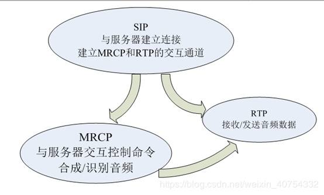
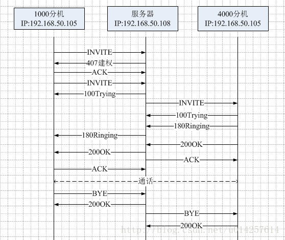

# 一.unimrcp架构。


简单来说就是sip建立连接，sdp定义会话描述的统一格式，mrcp依赖xml进行控制消息，rtp流发送语音。




# 二.mrcp概要

mrcp借用了sip协议来支持mrcp的处理流程。sip可以使用sip url通过网络来支持mrcp客户端来获取媒体资源，并且可以查询获取到媒体类型和其支持能力。它一旦获取到正确的媒体资源服务器信息，sip将会创建两个通信管道，一个是用来支持媒体会话，它支持发送或接收语音数据。这些数据可能是从媒体资源服务器发出也可能是来自于媒体资源服务器。另一个管道是控制会话，它用来支持mrcp客户端和媒体资源服务器之间的请求通信。通服务器端返回响应消息和事件。这里，mrcp协议是运行在控制会话之上。

 在mrcp客户端包括了sip协议栈和mrcp协议栈。后者扮演的就是一个mrcp客户端角色。当应用层的程序请求一个媒体资源时侯，它会调用媒体资源的api接口。此api接口通过sip协议栈会创建一个sip dialog并携带媒体资源服务器信息。sip协议栈会通过rtp对媒体服务器资源初始化一个媒体会话，并且通过mrcp对媒体资源服务器创建一个控制会话。
                
 在会话初始化过程也可以包括一些服务器可以预设的专用媒体资源。接下来，mrcp客户端可以通过会话控制直接调用这些专有的媒体资源。mrcp客户端可以在同样的终端设备或者作为其他实体的一个部分包含媒体资源。客户端的sip协议则可以充分利用信令和媒体分离的方式，它们分别通过不同的路径来处理。


# 三.mrcp协议


以上流程中，创建了会话以后，MRCP需要控制媒体资源。MRCP协议消息格式类似于HTTP的消息格式，也是一种外部格式。MRCP消息格式包括三种格式：请求消息，响应消息和事件。请求消息是从MRCP客户端发到媒体资源服务器端，而响应消息则是由媒体资源服务器端，根据客户端的请求返回的响应消息，并且响应消息中包含了一个三位数的状态码。另外，响应消息中包含了当前的请求状态，当前请求状态包括：PENDING，IN-PROGRESS 或 COMPLETE的其中一种。
　　PENDING 状态表示当前的请求在等待处理的队列中，等待进行处理，处理方式为先进先出的方式。IN-PROGRESS状态表示当前请求正在被处理。COMPLETE响应则表示完成请求处理，在当前的连接中无更多消息。在以上三种状态中，PENDING和IN-PROGRESS都表示请求未完成处理，需要更多的事件消息。事件消息允许媒体资源服务器端和客户端对某些状态的改变或对客户端发生一个事件来进行通信。事件消息中包括事件名称和请求状态。

1.语音合成

具体的请求消息格式如下：
```
　　MRCP/2.0 380 SPEAK 14321（MRCP/2.0 message-length method-name request-id）
　　Channel-Identifier: 43b9ae17@speechsynth
　　Content-Type: application/ssml+xml
　　Content-Length: 253
```


这个图是虽然不是语音合成请求但道理是一样的

响应格式如下：
```
MRCP/2.0 119 14321 200 IN-PROGRESS（MRCP/2.0 message-length request-id status-code request-state）
ID是14321，200 表示成功，正在处理中，119消息长度是119 bytes。
Channel-Identifier: 43b9ae17@speechsynth
Speech-Marker: timestamp=857206027059 // 这里是NTP时间
MRCP的状态码包括：200–299（Success）， 400–499（ Client error）和500–599（Server error）。这些状态码和SIP的状态码基本类似。
我们的请求的状态是IN-PROGRESS ，表示正在被媒体资源处理，大部分情况下，媒体数据可能已经返回到MRCP终端。
接下来，媒体资源服务器端生成一个SPEAK-COMPLETE事件，表示此请求已经完成，对于此请求来说，没有更多的事件进行处理。
```

2.语音识别
与上面相似，仅仅是methond-name不同。
RECOGNIZE请求消息如下：
```
　　MRCP/2.0 461 RECOGNIZE 32121
　　Channel-Identifier: 23af1e13@speechrecog
　　Content-ID:
　　Content-Type: application/srgs+xml
　　Content-Length: 289
  ```
响应如下：
```
MRCP/2.0 472 RECOGNITION-COMPLETE 32121 COMPLETE
　　Channel-Identifier: 23af1e13@speechrecog
　　Completion-Cause: 000 success
　　// 000 表示成功，001 表示无匹配结果，002 表示输入超时。
　　Content-Type: application/nlsml+xml
　　// W3C发布的NLSML
　　Content-Length: 289
  ```


# 四sip协议

1.简单过程


2.完整过程



# 五.sdp协议
因为它的内容比较少所以放在 最后说

SDP目的就是在媒体会话中，传递媒体流信息，允许会话描述的接收者去参与会话。SDP基本上在internet上工作。他定义了会话描述的统一格式,但并不定义多播地址的分配和SDP消息的传输,也不支持媒体编码方案的协商,这些功能均由下层传送协议完成。典型的会话传送协议包括:SAP(Session Announcement Protocol会话公告协议),SIP(Session Initiation Protocol，会话初始协议),RTSP,HTTP,和使用MIME的E-Mail。


SDP各个参数简单介绍
下列内容摘自3264协议[1]
```
v=0                                                                              
o=carol 28908764872 28908764872 IN IP4 100.3.6.6        //会话ID号和版本
s=-                                     //用于传递会话主题
t=0 0                                   //会话时间，一般由其它信令消息控制，因此填0
c=IN IP4 192.0.2.4              //描述本端将用于传输媒体流的IP
m=audio 0 RTP/AVP 0 1 3     //媒体类型 端口号 本端媒体使用的编码标识（Payload）集
a=rtpmap:0 PCMU/8000 //rtpmap映射表，各种编码详细描述参数，包括使用带宽（bandwidth）
a=rtpmap:1 1016/8000
a=rtpmap:3 GSM/8000
a=sendonly     //说明本端媒体流的方向，取值包括sendonly/recvonly/sendrecv/inactive
a=ptime:20     //说明媒体流打包时长
m=video 0 RTP/AVP 31 34
a=rtpmap:31 H261/90000
a=rtpmap:34 H263/90000
```


在SIP协议的包含的内容是SDP时，应该把Content-Type设置成application/sdp。

SDP:Session Description Protocol

SDP格式:

      Session description
         v=  (protocol version)
         o=  (owner/creator and session identifier)
         s=  (session name)
         i=* (session information)
         u=* (URI of description)
         e=* (email address)
         p=* (phone number)
         c=* (connection information - not required if included in all media)
         b=* (zero or more bandwidth information lines)
         One or more time descriptions ("t=" and "r=" lines, see below)
         z=* (time zone adjustments)
         k=* (encryption key)
         a=* (zero or more session attribute lines)
         Zero or more media descriptions

      Time description
         t=  (time the session is active)
         r=* (zero or more repeat times)

      Media description, if present
         m=  (media name and transport address)
         i=* (media title)
         c=* (connection information - optional if included at
              session-level)
         b=* (zero or more bandwidth information lines)
         k=* (encryption key)
         a=* (zero or more media attribute lines)
         
以上带"*"号的是可选的,其余的是必须的。一般顺序也按照上面的顺序来排列。

a=*是sdp协议扩展属性定义，除上面以外的，分解时其它的都可以扔掉。
a=charset属性指定协议使用的字符集。一般的是ISO-10646。


相关资料：
https://blog.csdn.net/wangzhe03091252/article/details/78044587 （mrcpv2）
https://blog.csdn.net/jobbofhe/article/details/78477407 (sip)
https://www.cnblogs.com/qingquan/archive/2011/07/14/2106834.html (rtsp)
https://www.cnblogs.com/idignew/p/7249056.html (sdp)


